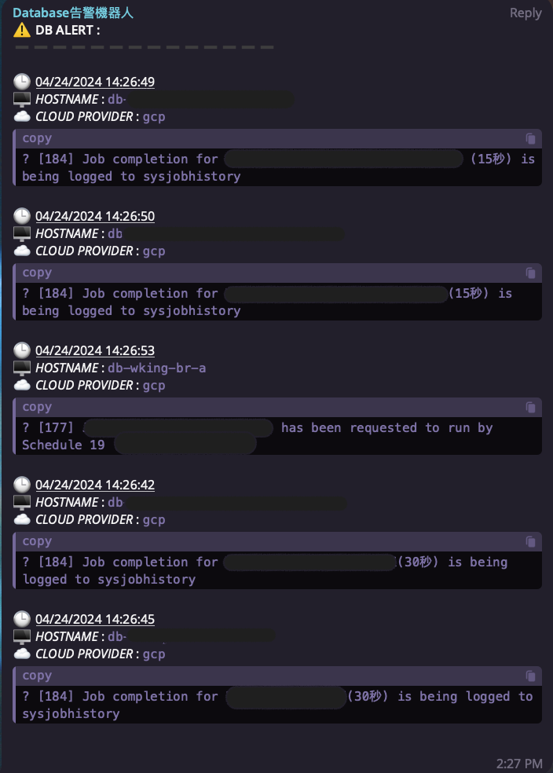

# TG-Database-Alert

#### Every minute, logs are retrieved from ElasticSearch for the current database, filtered for error messages, and then forwarded to Telegram for alerting.

### This project requires prerequisites:
* filebeat (Gather data and send it to Elastic)

### Result
